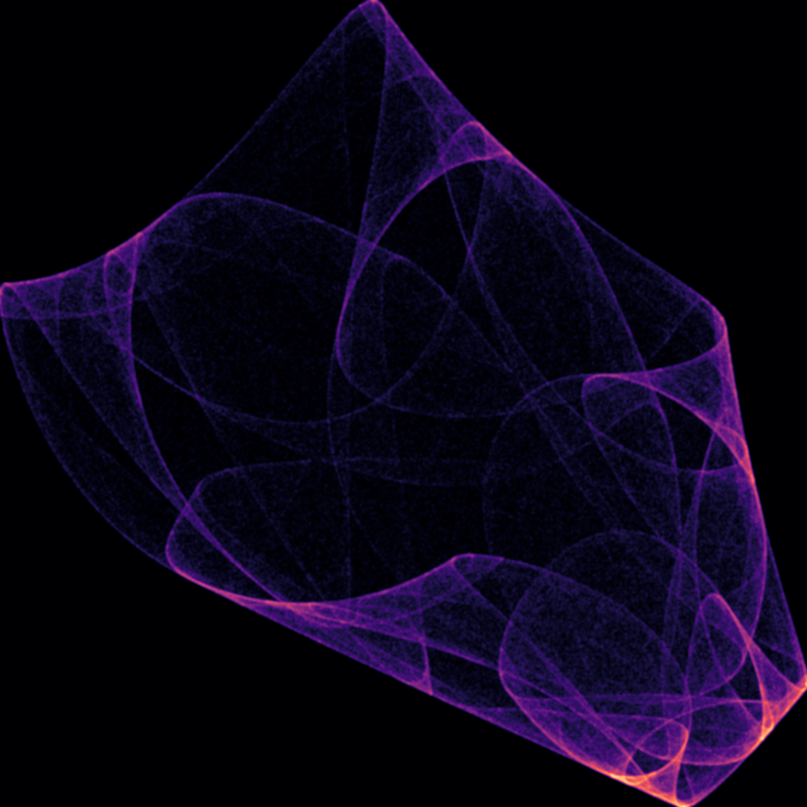

# Strange attractors
Automatic generation of attractors by using Lyapunov exponents to calculate promising chaothic attractors (and discarding point or infinity attractors),
based on the idea of [Paul Bourke](https://paulbourke.net/fractals/lyapunov/).

## Some examples

| | | |
|-----------|-----------|-----------|
|  |  |  |
|  |  |  |
|  |  |  |
|  |  |  |
|  |  |  |

## Code examples
Generate attractors and save their parameters:
```python
from lyapunov_exponents import createAttractor
createAttractor(out_path="new_attractors/out", examples=100, iterations=10_000)

# this will create 100 attractors and save their parameters in the specified folder, with
# a small 500x500 image preview for each one. 
```

Render a specific attractor from its parameters:
```python
from parallel import draw_single_attractor
from colors import create_linear_colormap, randomTriadColors

colors = [randomTriadColors(100, 255)]

render_kwargs = {
        "width": 1000,
        "height": 1000,
        "cmap": create_linear_colormap(colors),
        "dir": "new_attractors/renders",
        "interpolation": "histogram",
        "density_sigma": 0,
        "pad_size": 0.5
    }

draw_single_attractor("new_attractors/out/attractor_0.json", 
                       render_iterations=20_000_000,
                       **render_kwargs)
``` 

Render multiple attractors in parallel:
```python
from parallel import render_attractors_in_parallel
from multiprocessing import cpu_count
import glob
from colors import create_linear_colormap

RENDER_ITERS = 20_000_000 # this is a big amount but gives good quality renders
render_kwargs = {
        "width": 1000,
        "height": 1000,
        "cmap": create_linear_colormap(preset='viridis', 
            # this makes the background color white 
            recolor_base={'n':1, 'color':(255,255,255)}),
        "dir": "new_attractors/renders",
        "interpolation": "histogram",
        "pad_size": 0.5
    }

render_attractors_in_parallel(glob.glob("new_attractors/out/*.json"), 
                              RENDER_ITERS,
                              num_workers=cpu_count(),
                              batch_size=50, # set this lower if you have less memory
                              **render_kwargs)
```

Whole pipeline example: create multiple attractors, and render them in parallel with different preset and custom colormaps.
```python
from parallel import draw_attractors_in_parallel, draw_single_attractor
from colors import create_linear_colormap

CREATE_ITERATIONS = 100_000
EXAMPLES = 100
RENDER_ITERATIONS = 20_000_000 # long processing but good rendering
base_dir = "set_num"

render_kwargs = {
    "width": 1000,
    "height": 1000,
    "cmap": create_linear_colormap(preset='viridis'),
    "dir": f"{base_dir}/renders",
    "interpolation": "histogram",
    "density_sigma": 0,
    "pad_size": 0.5
}
#logging.basicConfig(level=logging.INFO)

# find EXAMPLES random attractors with CREATE_ITERATIONS iters for each one
createAttractor(out_path=f"{base_dir}/out", examples=EXAMPLES, iterations=CREATE_ITERATIONS)

cmaps = ['plasma', 'magma', 'viridis', 'cividis', 
            'turbo', 'summer', 'autumn', 'winter', 'copper']
# define a recoloring scheme to make the background white
recolor = {'n':1, 'color':(255,255,255), 'resample_size':512}

for cmap_name in cmaps:
    print(f"Rendering with colormap {cmap_name}...")
    render_kwargs['cmap'] = create_linear_colormap(preset=cmap_name, 
                                                    recolor_base=recolor)

    # rendering multiple attracctor is a perfect task for multiprocessing! cpu go brr
    results = draw_attractors_in_parallel(
        glob.glob(f"{base_dir}/out/*.json"), 
        RENDER_ITERATIONS, 
        n_processes=cpu_count() - 4, # leave some CPU for other tasks
        batch_size=50,
        **render_kwargs
    )

# custom colormap example
render_kwargs['cmap'] = create_linear_colormap(colors=[(255, 0, 0),(0, 255, 0)] ,
                                                recolor_base=recolor)
results = draw_attractors_in_parallel(
        glob.glob(f"{base_dir}/out/*.json"), 
        RENDER_ITERATIONS, 
        n_processes=cpu_count() - 4, # leave some CPU for other tasks
        batch_size=50,
        **render_kwargs
    )
```

---

A video generation utility is also provided in `attractor_video.py`, which can create videos of the attractor points being drawn over time.
An example of its usage:

```python
from lyapunov_exponents import loadAttractor, generateAttractorFromParameters
    
    RENDER_ITERATIONS = 200_000_000

    attractors = [15, 21, 1, 25, 13, 34]
    colors = ['viridis', 'afmhot', "binary", "gray", "twilight",
              "turbo", "BuPu", "YlGn", "YlOrRd", "Blues", "Reds", "Greens",
              "seismic", "Accent"]
        
    for n in attractors:
        print(f"Processing attractor {n}...")

        params = loadAttractor(f"examples/out/{n}_0.json")
        x, y, xmin, xmax, ymin, ymax = \
            generateAttractorFromParameters(params, RENDER_ITERATIONS)
        
        print(f"Attractor {n} loaded and generated.")

        for color in colors:
            videoAttractor(
                f"{n}_{color}",
                xmin, xmax,
                ymin, ymax,
                x, y,
                video_duration=10.0,
                fps=14,
                video_width=800,
                video_height=800,
                color_bias=0.25,
                pad_size=20,
                dir="videos",
                cmap=color,
                video_end_pad=2.0,
                experiment_name=f"colors"
            )

        print(f"Attractor {n} video generated.")
        print()
```
Outputs look something like this (but not as gifs):


Outputs are encoded with `mp4v`, but if you want a mobile-compatible format like `yuv420p`, try this:
```bash
ffmpeg -i "inputvideo.mp4" -c:v libx264 -pix_fmt yuv420p -c:a aac "outvideo_mobile.mp4"
```
or for a gif:
```bash
ffmpeg \
  -i video.mp4 \
  -r 15 \ # fps
  # this filter pipeline removes dithering-like artifacts of scaling
  -vf "scale=512:-1,split[s0][s1];[s0]palettegen[p];[s1][p]paletteuse" \
  out.gif
```

## TODO Some ideas to try 
- [x] separate plotting and point generation in the drawing code.
- [ ] refactor the generateFilename function to be used by all

- [x] optimize sequential functions with numba jit
- [ ] Add symbolic equations and save them as parameters. That way, automatic equation generation will be a possibility (with arbitrary params).
- [x] Test the correct loading with seed points: all attractors should work when loaded.
- [ ] Change the quadratic equation to use `a**x` instead of `a*x*x`.
- [ ] Test the Lyapunov normalization `lyapunov /= num_iters`.
- [ ] Implement fractal dimension calculation(need a meethod that yields all lyapunov exponents, nut just the highest).
- [ ] Perform data analysis on a big generated set of attractors + their parameters:
    - [ ] Augment parameters and calculate stats.
    - [ ] Cluster by attractor features.
    - [ ] Find out the relation the non-interesting generated attractors have with pixel density / exponents.
- [ ] Make higher dimensional attractors and project them into a smaller space.
- [ ] Make 3D attractors and plot them in 3D.
- [x] Make a video / gif of the points appearing with their respective colour.
- [x] add padding to sides of drawings (just blank space at the limits)
- [ ] add transparency to the histogram mode
- [ ] add `exists_ok=True` for ignoring existing files

## References!
https://paulbourke.net/fractals/lyapunov/

https://sprott.physics.wisc.edu/fractals/booktext/SABOOK.PDF

https://www.nathanselikoff.com/training/tutorial-strange-attractors-in-c-and-opengl

https://www3.fi.mdp.edu.ar/fc3/SisDin2009/Clase%202/nousado/CHAOSCOPE/help/en/manual/attractors.htm

http://devmag.org.za/2012/07/29/how-to-choose-colours-procedurally-algorithms/
